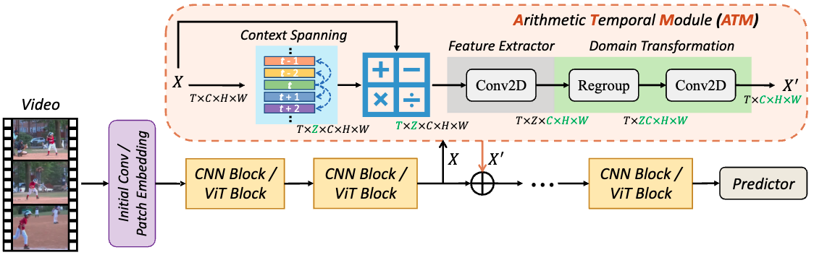

<div align="center">

<h2>【ICCV'2023】What Can Simple Arithmetic Operations Do for Temporal Modeling? </h2>

[](https://iccv2023.thecvf.com/)
[](https://arxiv.org/abs/2307.08908)


[Wenhao Wu](https://whwu95.github.io/)<sup>1,2</sup>, [Yuxin Song]()<sup>2</sup>, [Zhun Sun]()<sup>2</sup>, [Jingdong Wang](https://jingdongwang2017.github.io/)<sup>3</sup>, [Chang Xu](http://changxu.xyz/)<sup>1</sup>, [Wanli Ouyang](https://wlouyang.github.io/)<sup>3,1</sup>

 
<sup>1</sup>[The University of Sydney](https://www.sydney.edu.au/), <sup>2</sup>[Baidu](https://vis.baidu.com/#/), <sup>3</sup>[Shanghai AI Lab](https://www.shlab.org.cn/)

</div>


***
[](https://paperswithcode.com/sota/action-recognition-in-videos-on-something-1?p=what-can-simple-arithmetic-operations-do-for)
[](https://paperswithcode.com/sota/action-classification-on-kinetics-400?p=what-can-simple-arithmetic-operations-do-for)
[](https://paperswithcode.com/sota/action-recognition-in-videos-on-something?p=what-can-simple-arithmetic-operations-do-for)

This is the official implementation of our **ATM** (Arithmetic Temporal Module), which explores the potential of four simple arithmetic operations for temporal modeling. 

Our best model can achieve **89.4%** Top-1 Acc. on Kinetics-400, **65.6%** Top-1 Acc. on Something-Something V1, **74.6%** Top-1 Acc. on Something-Something V2!


<details ><summary>🔥 I also have other recent video recognition projects that may interest you ✨. </summary><p>


> [**Revisiting Classifier: Transferring Vision-Language Models for Video Recognition**](https://arxiv.org/abs/2207.01297)<br>
> Wenhao Wu, Zhun Sun, Wanli Ouyang <br>
> Accepted by AAAI 2023 & IJCV 2023 | [[Text4Vis Code]](https://github.com/whwu95/Text4Vis)


> [**Bidirectional Cross-Modal Knowledge Exploration for Video Recognition with Pre-trained Vision-Language Models**](https://arxiv.org/abs/2301.00182)<br>
> Wenhao Wu, Xiaohan Wang, Haipeng Luo, Jingdong Wang, Yi Yang, Wanli Ouyang <br>
> Accepted by CVPR 2023 | [[BIKE Code]](https://github.com/whwu95/BIKE)


</p></details>


<!-- ## Content
- [Content](#content)
- [📣 News](#-news)
- [🌈 Overview](#-overview)
- [📌 BibTeX \& Citation](#-bibtex--citation)
- [🎗️ Acknowledgement](#️-acknowledgement)
- [👫 Contact](#-contact) -->


## 📣 News
- [ ] `TODO`: All models and training codes will be released in September! 
-  `July 14, 2023`: 🎉Our **ATM** has been accepted by **ICCV-2023**.


## 🌈 Overview

The key motivation behind ATM is to explore the potential of simple arithmetic operations to capture auxiliary temporal clues that may be embedded in current video features, without relying on the elaborate design. The ATM can be integrated into both vanilla CNN backbone (e.g., ResNet) and Vision Transformer (e.g., ViT) for video action recognition.


<a name="bibtex"></a>
## 📌 BibTeX & Citation

If you use our code in your research or wish to refer to the baseline results, please use the following BibTeX entry😁.


```bibtex
@inproceedings{atm,
  title={What Can Simple Arithmetic Operations Do for Temporal Modeling?},
  author={Wu, Wenhao and Song, Yuxin and Sun, Zhun and Wang, Jingdong and Xu, Chang and Ouyang, Wanli},
  booktitle={Proceedings of the IEEE International Conference on Computer Vision (ICCV)},
  year={2023}
}
```


<a name="acknowledgment"></a>
## 🎗️ Acknowledgement

This repository is built upon portions of [VideoMAE](https://github.com/MCG-NJU/VideoMAE), [CLIP](https://github.com/openai/CLIP), and [EVA](https://github.com/baaivision/EVA). Thanks to the contributors of these great codebases.


## 👫 Contact
For any question, please file an issue or contact [Wenhao Wu](https://whwu95.github.io/).
